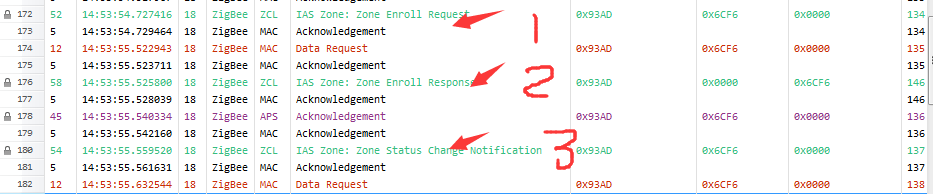
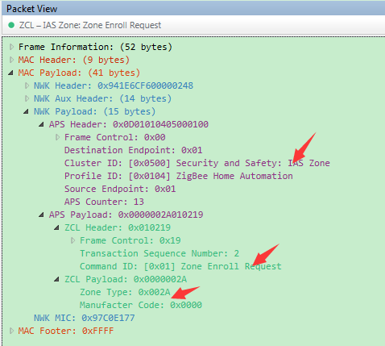
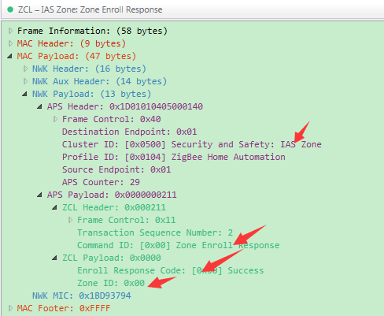
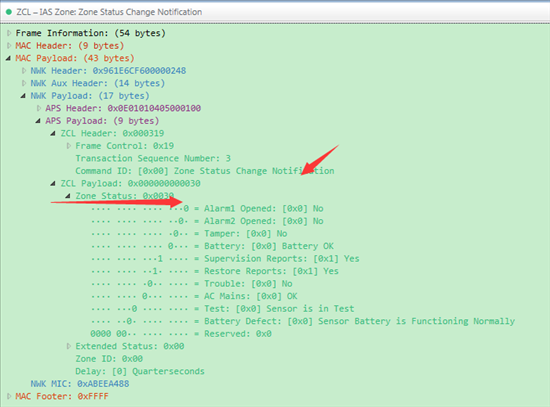
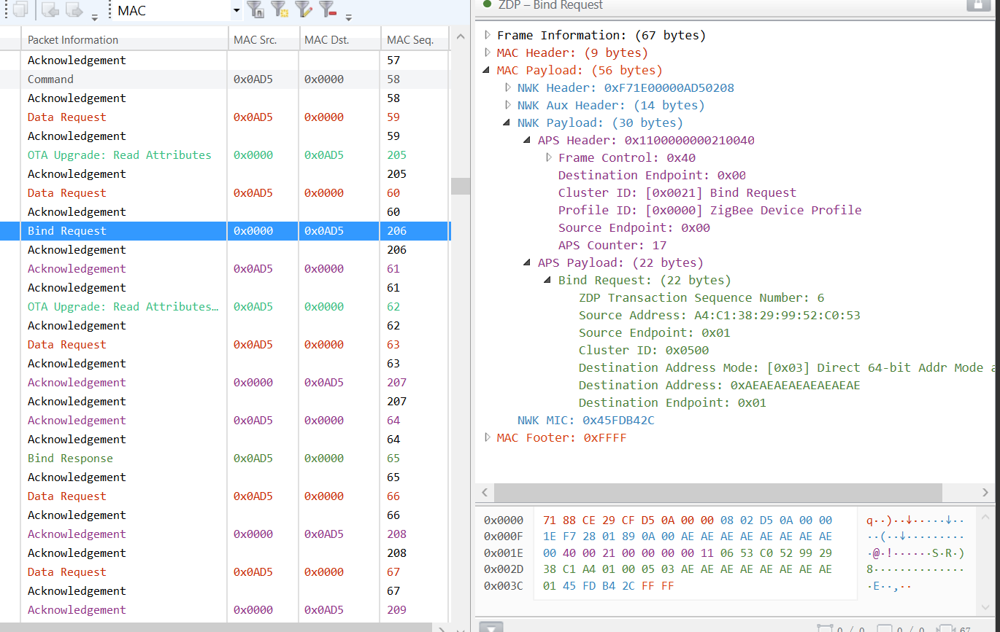
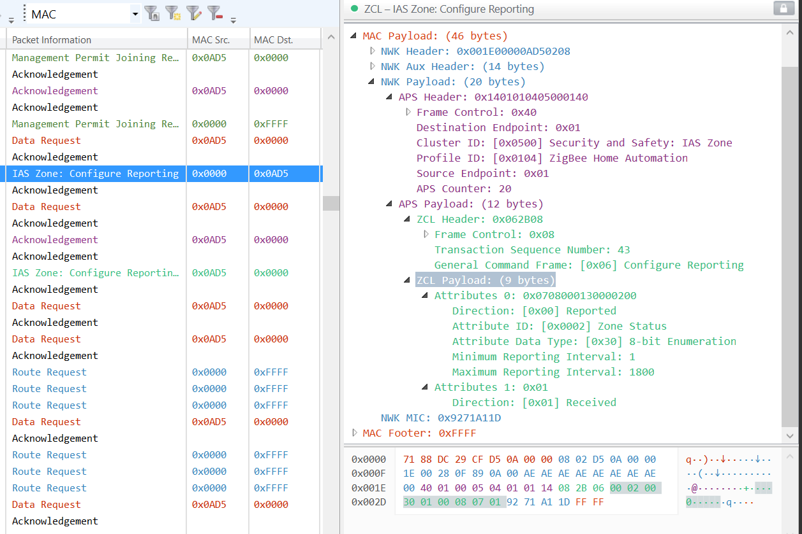
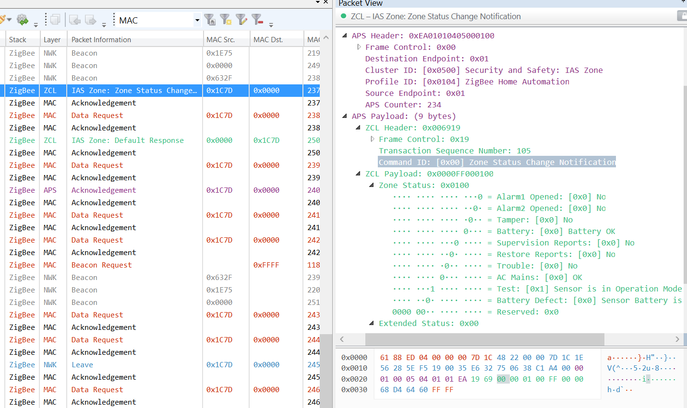

zcl_iasZoneAttr_t g_zcl_iasZoneAttrs =
{
	.zoneState		= ZONE_STATE_NOT_ENROLLED,  //是否ENROLLED
	.zoneType		= ZONE_TYPE_CONTACT_SWITCH, //传感器类型
	.zoneStatus		= 0x00,                     //传感器值
	.iasCieAddr		= {0x00},
	.zoneId 		= 0x10  //ZCL_ZONE_ID_INVALID,
};
属性表 zcl global read 0x0500 0x000 //读取zoneState
	 ZCL_ATTRID_ZONE_STATE,   0x00    
	 ZCL_ATTRID_ZONE_TYPE,    0x01  
	 ZCL_ATTRID_ZONE_STATUS,  0x02
	 ZCL_ATTRID_IAS_CIE_ADDR, 0x10
	 ZCL_ATTRID_ZONE_ID,      0x11

ZCL_CLUSTER_GEN_POLL_CONTROL 0x0020
#define ZCL_ATTRID_CHK_IN_INTERVAL						0x0000
#define ZCL_ATTRID_LONG_POLL_INTERVAL					0x0001
#define ZCL_ATTRID_SHORT_POLL_INTERVAL					0x0002
#define ZCL_ATTRID_FAST_POLL_TIMEOUT					0x0003
#define ZCL_ATTRID_CHK_IN_INTERVAL_MIN					0x0004
#define ZCL_ATTRID_LONG_POLL_INTERVAL_MIN				0x0005
#define ZCL_ATTRID_FAST_POLL_TIMEOUT_MAX				0x0006

short polling是在数据发送接收的时候起作用，当进入idle空闲以后，long polling才起作用
long polling使用的是在睡眠设备的选项，它的作用有两个：
    1、轮询父节点缓存的消息
    2、确保和父节点之间在线。
    一般情况下，为了确保睡眠设备不丢失数据的接收，long polling的时间小于7.8秒。

## 步骤总结
zdo in-cl-list add [clusterId:2] zdo out-cl-list add [clusterId:2]
zdo match (args)
   <uint16_t>  Two byte node id indicating wher
   <uint16_t>  Two byte profile id for the match descriptor request
zdo bind 参数详情
        <int16u>  Two byte destination node id
        <int8u>  Remote device's source endpoint to bind
        <int8u>  Remote endpoint to bind
        <int16u>  Cluster on which to bind
        <string>  Remote node EUI64
        <string>  Binding's dest EUI64.  Usually the local node's EUI64

1. 向0x0AD5查询是否有0x0500的clusterID
 zdo in-cl-list add 0x0500
 zdo match 0x0AD5 0x0104

2. 绑定
   zdo bind 0x0AD5  0x01 0x01 0x0500 {A4C138299952C053} {AEAEAEAEAEAEAEAE}
3. 写IAS IEEE
   写ep1 Cluster 0x0500的属性0x10,类型0xF0
   zcl global write 0x0500 0x0010 0xF0 {AEAEAEAEAEAEAEAE}
   send 0x0AD5 0x01 0x01
4. EndDevice调用zcl_iasZone_enrollReqCmd,请求ZoneID
   收到Response后,在sampleSensor_zclIasZoneEnrollRspCmdHandler中把id写到pZoneEnrollRsp->zoneId
5. 设置long poll时间:zcl poll-control long 20 (20/4=5秒)
   终端调用zb_setPollRate(pPollCtrlAttr->longPollInterval * QUEUE_POLL_RATE),可以减少设备Data Request间隔

## IAS 角色
1. IAS CIE:安防系统控制指示设备,通常是协调器.它辅助接收传感器(Zones)发出的信号 并控制设备(ACE)，同时还向报警设备(WD)发送信号
2. IAS ACE:安防系统辅助控制设备,常见的IAS ACE 设备有遥控器、开关等
3. IAS Zone:安防系统区域,能够探测某个区域的报警条件，并给 CIE 设备发送信号。IAS Zone设备支持二种报警模式：低电量报告和安防系统报告。常见的IAS Zone 设备有动作探测器、烟感 器等、门磁、水浸。
4. IAS WD:安防报警系统区域报警设备,当 IAS CIE的报警条件被触发，IAS 报警设备能够发出音频或可视的报警指示(警报声、 闪光灯等)。常见的 IAS WD 设备有声光报警器等
   
## contactSensor
1. 处于end deivce模式
2. IAS Zone
3. 会定期(POLL_RATE)发送Data request获得数据,

## end device关键参数
1. POLL_RATE:发送Data request周期,默认1秒,设成0,节点不会发送data request
2. RESPONSE_POLL_RATE: This is used after receiving a data confirmation to poll immediately for response messages...in milliseconds
3. QUEUE_POLL_RATE:This is used after receiving a data indication to poll immediately for queued messages...in milliseconds.
4. REJOIN_POLL_RATE:This is used as an alternate response poll rate only for rejoin request.This rate is determined by the response time of the parent that the device is trying to join.

## Enroll过程分析
1. match：CIE查找IAS Zone或者Zone主动查找CIE
2. Enroll：IAS Zone主动发送Zone Enroll Request(向网关请求 Zone ID 信息)

### 方法1：
   1. CIE匹配 CIE(协调器)主动查找该入网的设备是否支持 IAS Zone Cluster（0X500）。
   2. CIE向IAS Zone设备写CIE地址 如果设备支持IAS Zone Cluster，则向安防设备写入IAS_CIE_Address。
   3. 设备注册 安防设备主动Zone Enroll Request，CIE Zone Enroll Response。成功后，安防设备可上报报警等数据。
### 方法2：
   1. 设备匹配 设备（IAS Zone）主动查找网关是否支持 IAS Zone Cluster（0X500）。
   2. 设备请求CIE的IEEE 设备（IAS Zone）主动service discovery，请求网关IEEE
   3. 设备注册 安防设备主动Zone Enroll Request，CIE Zone Enroll Response。
     
     
     
     

## Zigbee ias zone注册流程和机制详解
### 注册的步骤
   1. zc发送match decriptor request
    
   2. zc发送IAS Zone:write Attribute
    zcl global read 0x0500 0x0010 //读ias addr
    send 0x0ad5 1 1
    
    
    
    
   3. ias zone发送Zone Enroll Request
   4. zc回Zone Enroll Response
### commands:
    ID	    name	                Direction	Description
    0x00	Zone Status Change 
            Notification	        S->C	    上报报警信息
    0x01	Zone Enroll Request	    S->C	    向网关请求 Zone ID 信息
    0x00	Zone Enroll Response	C->S	    网关返回给设备的 Zone ID 请求响应
### 注册过程
    将CIE的IEEE地址写入属性类型（0xf0）的节点簇（0x0500）属性（0x0010）
    CIE必须（使用写请求）写入群集0x0500，属性0x0010，数据类型IEEE address，值CIE的64位地址（小心） ，格式是小端）
    您可以通过在群集0x0500上发布读取请求，属性0x0000（ZoneState）来确认已注册的终端设备
    
    对于CIE设备，注册更复杂，ZCL堆栈不会为您执行此操作（尽管这可能取决于堆栈及其提供的任何附加功能）。
    CIE设备可以使用ZDO匹配描述符函数执行其自己的服务发现。它可能会发送MatchDescriptorRequest报告以查找IAS服务器，您需要回复MatchDescriptorResponse报告您支持此操作。通常，请求将查找IAS区域服务器群集（0x500），但您应检查数据包并进行相应的响应。请参阅ZigBee规范的2.4.3.1.7 Match_Desc_req和2.4.4.1.7 Match_Desc_rsp。如果IAS设备正在寻找区域控制器，它可能不接受任何请求，直到它收到此响应，实际上有些设备可能会离开网络，如果他们找不到服务他们请求。

    接下来，它可以通过发送ZoneEnrollRequest命令注册IAS服务，您的应用程序需要使用ZoneEnrollResponse对此进行响应，告诉设备它现在已注册到您的系统中。请参阅ZCL规范中的8.2.2.4.2区域注册请求命令。
### 注册的三种方法
Silicon Labs Zigbee设备中的安防类设备IAS在正常工作之前需要进行注册，否则不能正常发送报警信息，那么标准定义中ias zone设备支持多少种注册方式并且是怎么工作的呢？有三种方法使IAS Zone server注册到IAS CIE(网关)：

Trip-to-pair（配对）；
Auto-Enroll-Response（自动注册应答）；
Auto-Enroll-Request（自动注册请求）。

对于IAS Zone server需要支持下列其中一个：
Trip-to-pair & Auto-Enroll-Response；
Auto-Enroll-Request。

对于IAS Zone client需要支持下列其中一个：
Trip-to-pair & Auto-Enroll-Response；
Auto-Enroll-Request。

IAS Zone Client可以支持所有注册方法。Trip-to-Pair注册使用的方法主要是为了有一个显式的注册方法（例如，当用户使用GUI向导或其他调试工具及安装程序添加多个IAS服务器，以有序的方式，指定名称，并在系统中配置它们）。

通常使用比较多的是auto-enroll-response和auto-enroll-request。

当IAS Zone server入网后，client端会主动发送match request，判断入网设备是否支持ias zone server，如果支持它可以主动向终端发送 enroll response 并分配 zone id 完成注册；如果没有第一时间被动收到 enroll response，终端设备（zone server）可以主动 match request 到 IAS Zone Client 并且发送 enroll request，待收到 response 及其中的 zone id 后顺利完成注册。            

以上就是注册相关流程说明，为了提高注册的鲁棒性，终端设备需要考虑主动和被动注册，确保终端设备在任何情况下可以正常上报警报信息。

协调器先给设备发送“WriteIAS_CIE_Address”及match,设备会发送Zone Enroll Request命令给网关

## ias_zone_status_notification
 bit0 bit1分别代表传感器触发，bit2代表防拆触发报警，bit3为电池电压低压报警，bit4~bit7比较不常用，分别代表该属性是否周期性上报、报警回复正常是否上报、设备是否良好、主电源是否良好
 

[安防设备在入网时一直不发送IAS ZONE ENROLL]:https://e2echina.ti.com/support/wireless-connectivity/zigbee-and-thread/f/zigbee-thread-forum/164556/ias-zone-enroll/525451#525451